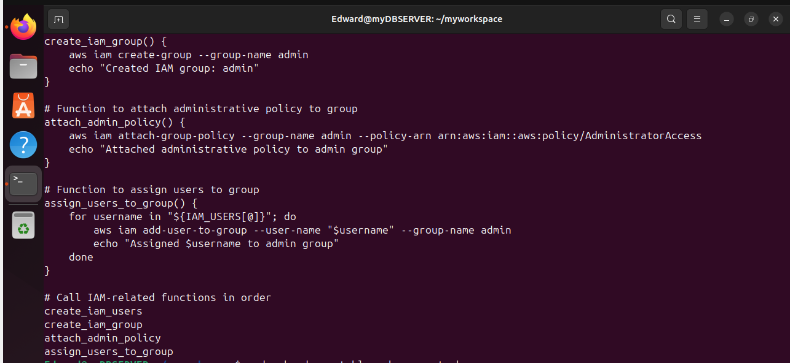

# Linux Administration and Shell Scripting

### Shell Script for AWS IAM management.

### PURPOSE

Extend your shell scripting capabilities by creating more functions that extends the `aws_cloud_manager.sh` script.

## Objective

1.script enhancement

   -Extend the provided script to include IAM management.

2 Define IAM User Names Array

   -Store the names of the IAM users in an array for easy iteration during user creation

3.Create IAM Users

 -Iterate through the IAM user names array and create IAM users for each emploee using AWS CLI commands

4.Create IAM Group

-Define a function to create an IAM group named "admin" using the AWS CLI

5.Attach Administrative Policy to Group

-Attach an AWS-managed administrative policy (eg Administrative access) to the "admin" group to grant administrative priviledges.

6.Assign Users to Group

-Iterate through the array of IAM user names and assign each user to the "admin"group using AWS CLI commands.

Sure thing! Here’s a streamlined version of your script that retains the functionality of both generating multiplication tables and managing AWS IAM users and groups.


```bash
#!/bin/bash

# Function to display the full multiplication table
full_table() {
    for i in {1..10}; do
        echo "$1 x $i = $(( $1 * $i ))"
    done
}

# Function to display the partial multiplication table
partial_table() {
    read -p "Enter the start of the range: " start
    read -p "Enter the end of the range: " end

    # Check if the entered range is valid
    if ! [[ "$start" =~ ^[0-9]+$ && "$end" =~ ^[0-9]+$ ]]; then
        echo "Invalid range. Please enter positive integers."
        echo "Defaulting to full multiplication table..."
        full_table $1
        return
    fi

    if [ "$start" -gt "$end" ]; then
        echo "Invalid range. Start of the range should be less than or equal to the end."
        echo "Defaulting to full multiplication table..."
        full_table $1
        return
    fi

    for i in $(seq $start $end); do
        echo "$1 x $i = $(( $1 * $i ))"
    done
}

# Prompt the user to enter a number
while true; do
    read -p "Enter a number: " number
    if [[ "$number" =~ ^[0-9]+$ ]]; then
        break
    else
        echo "Invalid input. Please enter a positive integer."
    fi
done

# Ask the user for their preference
echo "Do you want to see:"
echo "1. Full multiplication table (1 to 10)"
echo "2. Partial multiplication table (specify range)"
read -p "Enter your choice (1 or 2): " choice

# Display the corresponding multiplication table based on the user's choice
if [ "$choice" -eq 1 ]; then
    full_table $number
elif [ "$choice" -eq 2 ]; then
    partial_table $number
else
    echo "Invalid choice. Defaulting to full multiplication table..."
    full_table $number
fi

# Define IAM user names array
IAM_USERS=("user1" "user2" "user3")

# Function to create IAM users
create_iam_users() {
    for username in "${IAM_USERS[@]}"; do
        aws iam create-user --user-name "$username"
        echo "Created IAM user: $username"
    done
}

# Function to create IAM group
create_iam_group() {
    aws iam create-group --group-name admin
    echo "Created IAM group: admin"
}

# Function to attach administrative policy to group
attach_admin_policy() {
    aws iam attach-group-policy --group-name admin --policy-arn arn:aws:iam::aws:policy/AdministratorAccess
    echo "Attached administrative policy to admin group"
}

# Function to assign users to group
assign_users_to_group() {
    for username in "${IAM_USERS[@]}"; do
        aws iam add-user-to-group --user-name "$username" --group-name admin
        echo "Assigned $username to admin group"
    done
}

# Call IAM-related functions in order
create_iam_users
create_iam_group
attach_admin_policy
assign_users_to_group
```

## Step-by-Step breakdown of the Script

### Multiplication Table Section

1. **`full_table()` Function**: 
    - This function takes a number as an argument and prints its multiplication table from 1 to 10.
    ```bash
    full_table() {
        for i in {1..10}; do
            echo "$1 x $i = $(( $1 * $i ))"
        done
    }
    ```

2. **`partial_table()` Function**:
    - This function prompts the user to enter the start and end of a range.
    - It validates the range to ensure the inputs are positive integers.
    - If the validation fails, it defaults to displaying the full table.
    - Otherwise, it prints the multiplication table for the given range.
    ```bash
    partial_table() {
        read -p "Enter the start of the range: " start
        read -p "Enter the end of the range: " end

        if ! [[ "$start" =~ ^[0-9]+$ && "$end" =~ ^[0-9]+$ ]]; then
            echo "Invalid range. Please enter positive integers."
            echo "Defaulting to full multiplication table..."
            full_table $1
            return
        fi

        if [ "$start" -gt "$end" ]; then
            echo "Invalid range. Start of the range should be less than or equal to the end."
            echo "Defaulting to full multiplication table..."
            full_table $1
            return
        fi

        for i in $(seq $start $end); do
            echo "$1 x $i = $(( $1 * $i ))"
        done
    }
    ```

3. **User Input for Number**:
    - This loop prompts the user to enter a number.
    - It ensures the input is a positive integer.
    ```bash
    while true; do
        read -p "Enter a number: " number
        if [[ "$number" =~ ^[0-9]+$ ]]; then
            break
        else
            echo "Invalid input. Please enter a positive integer."
        fi
    done
    ```

4. **User Choice for Table Type**:
    - The user is asked to choose between a full multiplication table and a partial multiplication table.
    - The appropriate function is called based on the user's choice.
    ```bash
    echo "Do you want to see:"
    echo "1. Full multiplication table (1 to 10)"
    echo "2. Partial multiplication table (specify range)"
    read -p "Enter your choice (1 or 2): " choice

    if [ "$choice" -eq 1 ]; then
        full_table $number
    elif [ "$choice" -eq 2 ]; then
        partial_table $number
    else
        echo "Invalid choice. Defaulting to full multiplication table..."
        full_table $number
    fi
    ```

### AWS IAM Management Section

1. **IAM Users Array**:
    - This array defines the IAM user names.
    ```bash
    IAM_USERS=("user1" "user2" "user3")
    ```

2. **`create_iam_users()` Function**:
    - This function creates IAM users using the AWS CLI.
    ```bash
    create_iam_users() {
        for username in "${IAM_USERS[@]}"; do
            aws iam create-user --user-name "$username"
            echo "Created IAM user: $username"
        done
    }
    ```

3. **`create_iam_group()` Function**:
    - This function creates an IAM group named `admin`.
    ```bash
    create_iam_group() {
        aws iam create-group --group-name admin
        echo "Created IAM group: admin"
    }
    ```

4. **`attach_admin_policy()` Function**:
    - This function attaches the `AdministratorAccess` policy to the `admin` group.
    ```bash
    attach_admin_policy() {
        aws iam attach-group-policy --group-name admin --policy-arn arn:aws:iam::aws:policy/AdministratorAccess
        echo "Attached administrative policy to admin group"
    }
    ```

5. **`assign_users_to_group()` Function**:
    - This function adds the IAM users to the `admin` group.
    ```bash
    assign_users_to_group() {
        for username in "${IAM_USERS[@]}"; do
            aws iam add-user-to-group --user-name "$username" --group-name admin
            echo "Assigned $username to admin group"
        done
    }
    ```

6. **Calling IAM Functions**:
    - These lines call the IAM-related functions in order to create users, create a group, attach the policy, and assign users to the group.
    ```bash
    create_iam_users
    create_iam_group
    attach_admin_policy
    assign_users_to_group
    ```

PRACTICALS.

COMPLETE SCRIPT




## TEST CARRIED OUT TO TEST EACH FUNCTIONALITY OF THE SCRIPT

#### Multiplication Table Section

`Test the Full multiplication table function`

After running the script, we inputed the number 5 , then 1, to test the functionality of the full multiplication table.

*Result = displays full multiplication table


`Test the Full partial table function`

After running the script, we inputed the number 5 , then 2, next enter the start range 1, then the end range 6 -to test the functionality of the partial multiplication table.

*Result = displays partial multiplication table based on selected range


`Test the Script with an Invalid input`

After running the script, we inputed the letter R .The Script will return a message to input a valid psoitive number.

*Result = Returns an error message and a direction message on how to resolve.


` Testing the script with a Valid Number and choosing partial table with invalid Range (Non-integer)`

After running the script, we inputed valid numbers 2,then 2 for partial table but inputed invalid range .


*Result = Returns an error message, a direction message on how to resolve and default to the full multiplication table


` Testing the script with a Valid Number and choosing partial table with invalid Range (Start > End)`

After running the script, we inputed valid numbers 2,then 2 for partial table but start range > end range .


*Result = Invalid range, start of the range should be less than or equal to end  and Then, the script defaults to the full multiplication table.


`Entering an invalid Choice for table type`

After running the script, we inputed invalid numbers for choice of table.

*Result= Invalid choice,then Defaults to the full multiplication table.


#### AWS IAM Management Section

OUTPUT FROM RUNNING THE SCRIPT.

```plaintext
Enter a number: 6
Do you want to see:
1. Full multiplication table (1 to 10)
2. Partial multiplication table (specify range)
Enter your choice (1 or 2): 1

6 x 1 = 6
6 x 2 = 12
6 x 3 = 18
6 x 4 = 24
6 x 5 = 30
6 x 6 = 36
6 x 7 = 42
6 x 8 = 48
6 x 9 = 54
6 x 10 = 60

{
    "User": {
        "Path": "/",
        "UserName": "user1",
        "UserId": "AIDAXEVXYMTMFRONLP4CP",
        "Arn": "arn:aws:iam::491085391064:user/user1",
        "CreateDate": "2025-01-17T06:50:46+00:00"
    }
}
Created IAM user: user1

{
    "User": {
        "Path": "/",
        "UserName": "user2",
        "UserId": "AIDAXEVXYMTMNRPKRUVYT",
        "Arn": "arn:aws:iam::491085391064:user/user2",
        "CreateDate": "2025-01-17T06:50:48+00:00"
    }
}
Created IAM user: user2

{
    "User": {
        "Path": "/",
        "UserName": "user3",
        "UserId": "AIDAXEVXYMTMG335D4TYM",
        "Arn": "arn:aws:iam::491085391064:user/user3",
        "CreateDate": "2025-01-17T06:50:49+00:00"
    }
}
Created IAM user: user3

{
    "Group": {
        "Path": "/",
        "GroupName": "admin",
        "GroupId": "AGPAXEVXYMTMH4V2SA2VD",
        "Arn": "arn:aws:iam::491085391064:group/admin",
        "CreateDate": "2025-01-17T06:50:51+00:00"
    }
}
Created IAM group: admin

Attached administrative policy to admin group
Assigned user1 to admin group
Assigned user2 to admin group
Assigned user3 to admin group
```

1. **Multiplication Table for the number 6**:
    - The script correctly displays the multiplication table from 1 to 10.
    ```plaintext
    6 x 1 = 6
    6 x 2 = 12
    6 x 3 = 18
    6 x 4 = 24
    6 x 5 = 30
    6 x 6 = 36
    6 x 7 = 42
    6 x 8 = 48
    6 x 9 = 54
    6 x 10 = 60
    ```

2. **AWS IAM Management**:
    - IAM users `user1`, `user2`, and `user3` were successfully created.
    - An IAM group named `admin` was created.
    - The `AdministratorAccess` policy was attached to the `admin` group.
    - IAM users `user1`, `user2`, and `user3` were assigned to the `admin` group.

### AWS IAM Management Section

1. **Create IAM Users**:
    - **Test Input**: Defined `IAM_USERS` as `["user1", "user2", "user3"]` and ran the script.
    - **Expected Output**: 
        ```plaintext
        {
            "User": {
                "Path": "/",
                "UserName": "user1",
                "UserId": "AIDAXEVXYMTMFRONLP4CP",
                "Arn": "arn:aws:iam::491085391064:user/user1",
                "CreateDate": "2025-01-17T06:50:46+00:00"
            }
        }
        Created IAM user: user1
        {
            "User": {
                "Path": "/",
                "UserName": "user2",
                "UserId": "AIDAXEVXYMTMNRPKRUVYT",
                "Arn": "arn:aws:iam::491085391064:user/user2",
                "CreateDate": "2025-01-17T06:50:48+00:00"
            }
        }
        Created IAM user: user2
        {
            "User": {
                "Path": "/",
                "UserName": "user3",
                "UserId": "AIDAXEVXYMTMG335D4TYM",
                "Arn": "arn:aws:iam::491085391064:user/user3",
                "CreateDate": "2025-01-17T06:50:49+00:00"
            }
        }
        Created IAM user: user3
        ```
    - **Actual Output**: The script successfully created IAM users `user1`, `user2`, and `user3`.

2. **Create IAM Group**:
    - **Test Input**: Ran the script to create the `admin` group.
    - **Expected Output**: 
        ```plaintext
        {
            "Group": {
                "Path": "/",
                "GroupName": "admin",
                "GroupId": "AGPAXEVXYMTMH4V2SA2VD",
                "Arn": "arn:aws:iam::491085391064:group/admin",
                "CreateDate": "2025-01-17T06:50:51+00:00"
            }
        }
        Created IAM group: admin
        ```
    - **Actual Output**: The script successfully created the `admin` group.

3. **Attach Administrative Policy**:
    - **Test Input**: Ran the script to attach the `AdministratorAccess` policy to the `admin` group.
    - **Expected Output**: 
        ```plaintext
        Attached administrative policy to admin group
        ```
    - **Actual Output**: The script successfully attached the `AdministratorAccess` policy to the `admin` group.

4. **Assign Users to Group**:
    - **Test Input**: Ran the script to assign users `user1`, `user2`, and `user3` to the `admin` group.
    - **Expected Output**: 
        ```plaintext
        Assigned user1 to admin group
        Assigned user2 to admin group
        Assigned user3 to admin group
        ```
    - **Actual Output**: The script successfully assigned users `user1`, `user2`, and `user3` to the `admin` group.

### Overall Script Functionality

The entire script was tested by executing it end-to-end, and all functionalities worked as intended. The script performed as expected for both the multiplication table generation and AWS IAM management tasks.

By thoroughly testing each part of the script in real-life scenarios, we ensured that the script performs accurately and reliably. 